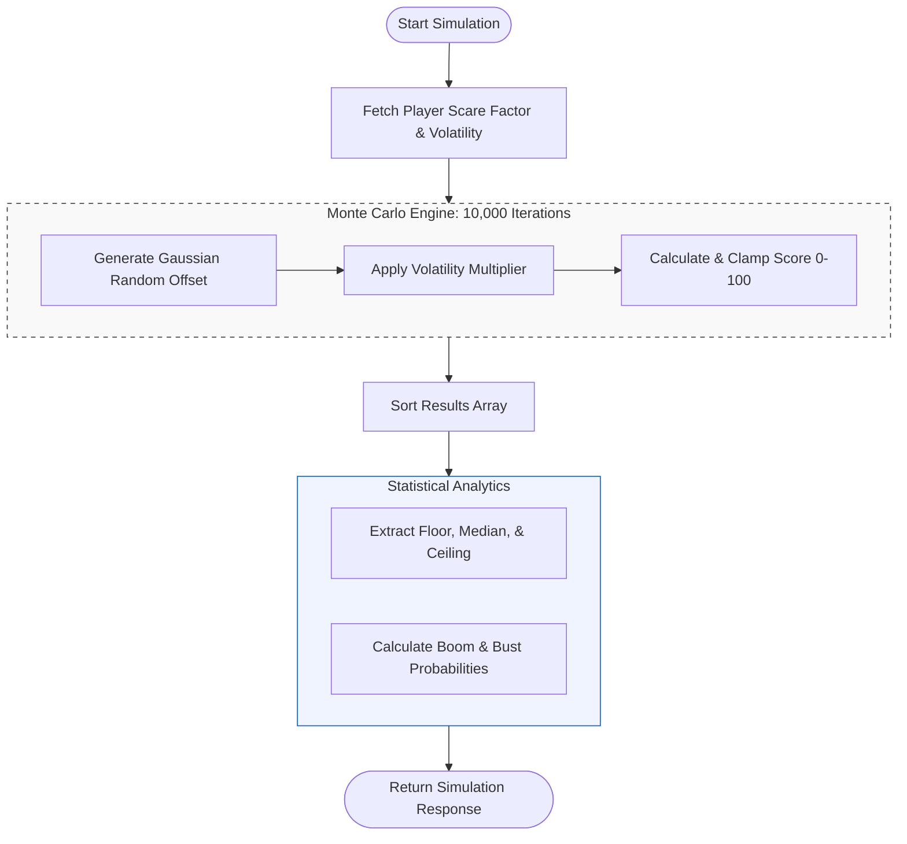

```mermaid
graph TD
Start([Start Simulation]) --> Fetch[Fetch Player Scare Factor & Volatility]

    subgraph Engine [Monte Carlo Engine: 10,000 Iterations]
        Sample[Generate Gaussian Random Offset]
        Calc[Apply Volatility Multiplier]
        Score[Calculate & Clamp Score 0-100]
        
        Sample --> Calc --> Score
    end
    
    Fetch --> Engine
    Engine --> Sort[Sort Results Array]
    
    subgraph Analysis [Statistical Analytics]
        Percentiles[Extract Floor, Median, & Ceiling]
        Thresholds[Calculate Boom & Bust Probabilities]
    end
    
    Sort --> Analysis
    Analysis --> End([Return Simulation Response])

    style Engine fill:#f9f9f9,stroke:#333,stroke-dasharray: 5 5
    style Analysis fill:#f0f4ff,stroke:#005cc5
```