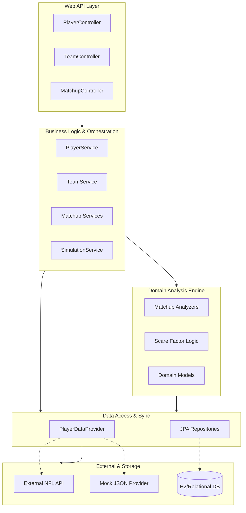

```mermaid
graph TD
subgraph API_Layer [Web API Layer]
PC[PlayerController]
TC[TeamController]
MC[MatchupController]
end

    subgraph Service_Layer [Business Logic & Orchestration]
        PS[PlayerService]
        TS[TeamService]
        MS[Matchup Services]
        SS[SimulationService]
    end

    subgraph Analysis_Engine [Domain Analysis Engine]
        direction LR
        Analyzers[Matchup Analyzers]
        Scare[Scare Factor Logic]
        Models[Domain Models]
    end

    subgraph Data_Orchestration [Data Access & Sync]
        PDP[PlayerDataProvider]
        Repo[JPA Repositories]
    end

    subgraph Infrastructure [External & Storage]
        direction LR
        API[External NFL API]
        Mock[Mock JSON Provider]
        DB[(H2/Relational DB)]
    end

    %% Flows
    API_Layer --> Service_Layer
    
    Service_Layer --> Analysis_Engine
    Service_Layer --> Data_Orchestration
    
    Analysis_Engine --> Data_Orchestration
    
    Data_Orchestration --> Infrastructure
    PDP -.-> API & Mock
    Repo -.-> DB
```